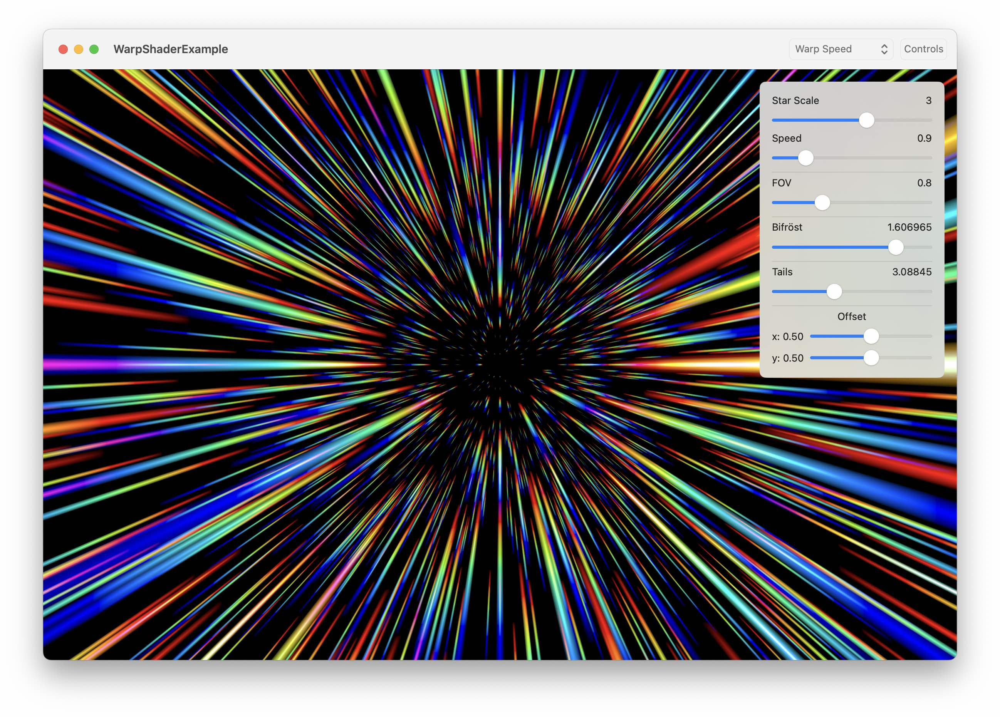

# WarpShader

This is a Metal shader example for SwiftUI based on “Hazel Quantock” / “TekF” from this code: https://www.shadertoy.com/view/Xdl3D2



## Installation

Add WarpShader as a package dependency by either using Xcode > File > Add Package Dependencies… and choosing this repo. Or by adding this package to the dependencies list if you’re using a Swift Package file directly. 

## Usage

Example usage for SwiftUI is in `ContentView.swift`.

Apply the `.warp()` view modifier to any view.

## Customization

The modifier has a good number of properties that can be customized.

```swift
SomeView()
    .warp(
        starScale: starScale, // relative star size. Things get chonky around 3.5 or so
        speed: speed, // zippy zoom!
        fov: fov, // lower values show a wider view
        bifrost: bifrost, // By Thor’s beard: higher values increase the red-blue separation of stars
        tails: tails, // higher values turn stars into longer lines
        starFieldOffset: starFieldOffset // changes the point of origin of stars
    )
```

I highly recommend building the included app, WarpShaderExample, clicking the “Controls” button, and finding values you find most pleasing. To build the app from this repo, chooseo the `WarpShaderExample` target then ‘Run’.

Animating between warp parameters leads to many interesting results that may seem familiar.
